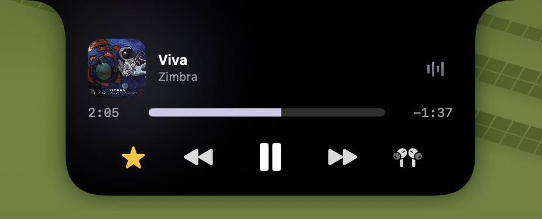

<h1 align="center">upper</h1>

upper is a macOS utility application that brings dynamic functionality to the notch on your Mac. It provides an elegant, interactive overlay near the top of your screen that expands to show useful information and media controls.

## Requirements

- macOS 26.0+
- Swift 6.0+
- Xcode 17+

## Getting Started

1. Clone the repository.
2. Open `upper.xcodeproj` in Xcode.
3. Build and run the `upper` scheme.
4. The app runs as an accessory (menu bar app). Look for the "sparkle" icon in your menu bar to access settings, open the debug window, or quit the application.

## Permissions

upper requires AppleEvents permissions (`NSAppleEventsUsageDescription`) to communicate with other applications (such as Music/Spotify) via AppleScript for media control when necessary.

## License

This project is licensed under the MIT License - see the LICENSE file for details.
